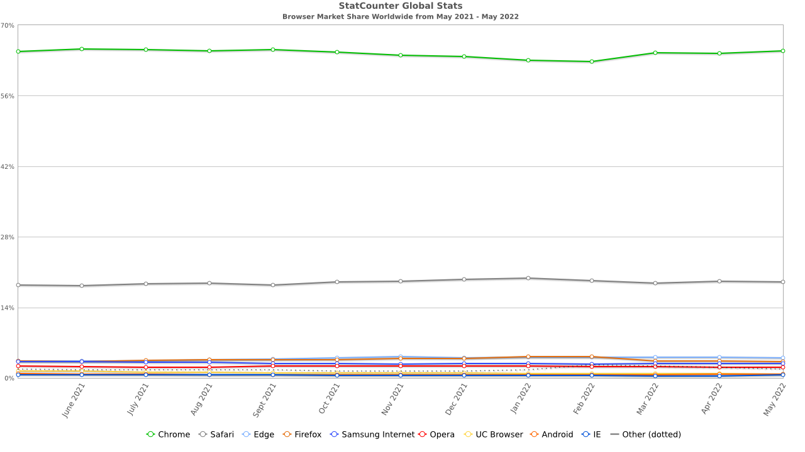

# 1.6 Hardware and Software Requirements

## Development Requirements

The developing requirements are the hardware required on my end to develop the project. I will be using Visual Studio Code as the text editor and use a locally hosted webserver to test my project within the browser using python. I will also use Phaser as the main library due to its integration of matter.js 2D physics.

| Software                 | Hardware Required                                                                                   |
| ------------------------ | --------------------------------------------------------------------------------------------------- |
| Visual Studio Code       | <ul><li>1.6 GHz processor</li><li>1 GB of RAM</li><li>200 MB of disk space</li></ul>                |
| Python (For web hosting) | <ul><li>Windows 7-10</li><li>2GB of RAM</li></ul>                                                   |
| Google Chrome (Windows)  | <ul><li>Windows 7 or later</li><li>Intel Pentium 4 processor or later that's SSE3 capable</li></ul> |

[(Microsoft, 2022)](../analysis/references.md) [(Google, 2012)](../analysis/references.md)

## User Requirements

For the user, the only requirements are based on what browser they are using. I will only target the Windows and Mac operating system, as they are most common, and I will also not support mobile as previously discussed in 1.4a. The browsers I will consider will be the browsers with the current highest market share, which is Google, Safari and Edge [(StatCounter, n.d.)](../analysis/references.md).



| Platform | Requirements                                                                                                        |
| -------- | ------------------------------------------------------------------------------------------------------------------- |
| Windows  | 

<ul><li>Windows 7 or later</li></ul><ul><li>Intel Pentium 4 processor or later that's SSE3 capable</li></ul> |
| Mac      | 

<ul><li>OS X El Capitan 10.11 or later</li></ul>                                                             |



| Platform | Requirements                                                                                                                                                                                              |
| -------- | --------------------------------------------------------------------------------------------------------------------------------------------------------------------------------------------------------- |
| Mac      | <ul><li>Mac OS X Leopard 10.5.7 or Mac OS X Tiger 10.4.11 and Security Update 2009-002</li><li>Intel processor or a Power PC G5, G4, or G3 processor and built-in FireWire</li><li>256MB of RAM</li></ul> |



| Platform | Requirements                               |
| -------- | ------------------------------------------ |
| Windows  | <ul><li>Windows 7 onwards</li></ul>        |
| MacOS    | <ul><li>Sierra (10.12) and later</li></ul> |



[(Google, 2012)](../analysis/references.md) [(Apple, 2009)](../analysis/references.md) [(Microsoft, 2021)](../analysis/references.md)
