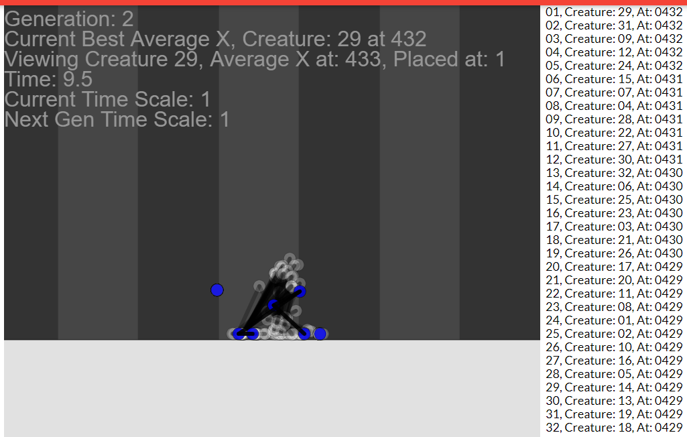

# 3.3 Checking Development Tests

## Cycle 1

### Tests

| Test | Instructions             | What I expect                                 | What actually happens | Pass/Fail |
| ---- | ------------------------ | --------------------------------------------- | --------------------- | --------- |
| 1    | Run local host           | Webpage is viewable on my local host          | As Expected           | Pass      |
| 2    | Run Phaser example scene | The webpage displays and run the phaser scene | As Expected           | Pass      |
| 3    | Run modified example     | The webpage displays and run the phaser scene | As Expected           | Pass      |

### Evidence 

<figure><figcaption>
Game Webpage
</figcaption></figure>

<figure><figcaption>
Phaser example scene
</figcaption></figure>

<figure><figcaption>
Initial constraint between two objects
</figcaption></figure>

<figure><figcaption>
Only the most recent two objects have a constraint
</figcaption></figure>

## Cycle 2

| Test | Instructions                                 | What I expect                                         | What actually happens                                  | Pass/Fail |
| ---- | -------------------------------------------- | ----------------------------------------------------- | ------------------------------------------------------ | --------- |
| 1    | Use p5.js to draw canvas.                    | A canvas to be drawn centrally in the scene.          | A canvas was drawn center top.                         | Pass.     |
| 2    | Draw a square to a Matter.js physics square. | Have a square drawn that is affected by gravity.      | A square is drawn and affected by gravity.             | Pass.     |
| 3    | Create a static ground plane.                | A static plane is created at the bottom of the scene. | A static plane was created at the bottom of the scene. | Pass.     |
| 4    | Give the graphics rotation.                  | The squares rotate when expected to.                  | The square graphics follows the physic rotation.       | Pass.     |
| 5    | Have new squares create with the mouse drag. | New squares are constantly created when dragging.     | New squares are constantly created when dragging.      | Pass.     |

## Cycle 3

| Test | Instructions                                               | What I expect                                                  | What actually happens                             | Pass/Fail |
| ---- | ---------------------------------------------------------- | -------------------------------------------------------------- | ------------------------------------------------- | --------- |
| 1    | Draw a square / circle using the function.                 | The function to create and draw the object.                    | An object was created and drawn.                  | Pass.     |
| 2    | Draw a square / circle using the function in another file. | The function to create and draw the object the same as before. | An object was created and drawn.                  | Pass.     |
| 3    | Pass null / nothing into the options in myRect / myCircle. | The function to draw a square with default options.            | The function draws a square with default options. | Pass.     |
| 4    | Pass options into the functions such as isStatic = true.   | The created body will be static and the graphics match this.   | A static body and graphics is created.            | Pass.     |

## Cycle 4

| Test | Instructions                                            | What I expect                                                                                    | What actually happens                        | Pass/Fail |
| ---- | ------------------------------------------------------- | ------------------------------------------------------------------------------------------------ | -------------------------------------------- | --------- |
| 1    | Drag a square around with the mouse.                    | The square to follow the mouse when dragged.                                                     | The square follows the mouse when dragged.   | Pass.     |
| 2    | Create objects with the collisionFilter in the options. | Objects rendered as normal.                                                                      | Objects rendered as normal.                  | Pass.     |
| 3    | Drag the circle into other objects.                     | Based on the collisionFilter, the circle should only collide with the floor and objects on cat1. | The circle collies with objects as expected. | Pass.     |

## Cycle 5

| Test | Instructions                                                                           | What I expect                            | What actually happens          | Pass/Fail |
| ---- | -------------------------------------------------------------------------------------- | ---------------------------------------- | ------------------------------ | --------- |
| 1    | Have a scene loaded from the scene manager.                                            | The scene to show as normal.             | The scene displayed as normal. | Pass.     |
| 2    | With the code in the scenes themselves, be able to change sceneIndex and switch scene. | On input, the next scene is switched to. | The next scene is switched to. | Pass.     |
| 3    | Have the click to create cube function work from the scene manager script.             | A cube is created on click.              | The scene reloads              | Fail.     |

## Cycle 6

| Test | Instructions                                                                                                                | What I expect                                                         | What actually happens                                                            | Pass/Fail |
| ---- | --------------------------------------------------------------------------------------------------------------------------- | --------------------------------------------------------------------- | -------------------------------------------------------------------------------- | --------- |
| 1    | Clicking on the "Joint" button and placing a joint (circle) on canvas and off canvas.                                       | A joint to be placed at the click location and not placed off canvas. | The joint is placed on the canvas, but not when the mouse is outside the canvas. | Pass.     |
| 2    | Clicking on the "Muscle" button and on two joints to create a constraint between them.                                      | A constraint to be created.                                           | A constraint is created.                                                         | Pass.     |
| 3    | Placing multiple constraints coming from one joint.                                                                         | All constraints to be placed correctly.                               | All constraints are placed correctly.                                            | Pass.     |
| 4    | Place a joint, select it for the start of a constraint, restart, place another joint, click on it again in constraint mode. | Nothing to happen                                                     | Constraint is placed from empty space to the new joint                           | Fail.     |
| 5    | Press "Restart" button.                                                                                                     | All placed objects are removed.                                       | All placed objects are removed.                                                  | Pass      |

## Cycle 7

| Test | Instructions                                                                          | What I expect                                                                   | What actually happens                                                         | Pass/Fail |
| ---- | ------------------------------------------------------------------------------------- | ------------------------------------------------------------------------------- | ----------------------------------------------------------------------------- | --------- |
| 1    | Press the done button when under the required amount of objects.                      | The game to not change scenes and a message to appear in the console.           | The game does not change scenes and a message appears in the console.         | Pass.     |
| 2    | Create a viable creature and press done.                                              | The game to change to the evolution\_Scene.js                                   | The game changes to the evolution\_Scene.js.                                  | Pass.     |
| 3    | Create a viable creature and press done.                                              | Above and the creature to appear in the scene with physics and gravity applied. | Above and the creature appears in the scene with physics and gravity applied. | Pass.     |
| 4    | Change the amount of creatures created to 5, Create a viable creature and press done. | Above and 4 more creatures also appear and each have unique collision.          | Above and 4 more creatures also appear and each have unique collision.        | Pass.     |
| 5    | Change the amount of creatures created to 5, Create a viable creature and press done. | Above and 99 more creatures also appear and each have unique collision.         | Above and 99 more creatures also appear but some fall through the floor.      | Fail.     |

## Cycle 8

| Test | Instructions                           | What I expect                                                  | What actually happens                                       | Pass/Fail |
| ---- | -------------------------------------- | -------------------------------------------------------------- | ----------------------------------------------------------- | --------- |
| 1    | Create a creature with 3 constraints.  | The neural network to  make the creatures move in unique ways. | The neural network makes the creatures move in unique ways. | Pass      |
| 2    | Create a creature with 10 constraints. | The neural network to  make the creatures move in unique ways. | The neural network makes the creatures move in unique ways. | Pass      |

## Cycle 9

| Test | Instructions                                                                                                         | What I expect                                                          | What actually happens                                                  | Pass/Fail |
| ---- | -------------------------------------------------------------------------------------------------------------------- | ---------------------------------------------------------------------- | ---------------------------------------------------------------------- | --------- |
| 1    | In creature\_creator.js, create a node and create the start of a muscle from the node.                               | A line to be rendered from the node to the mouse.                      | A line is rendered from the node to the mouse.                         | Pass.     |
| 2    | In creature\_creator.js, create a node and create the start of a muscle from the node and then click the node again. | The line rendered from the mouse disappears and no constraint is made. | The line rendered from the mouse disappears and no constraint is made. | Pass.     |
| 3    | Create  a creature and go into evolution\_scene.js                                                                   | The camera to be zoomed out and to follow the rightmost creature.      | The camera is zoomed out and follows the rightmost creature.           | Pass.     |
| 4    | Create  a creature and go into evolution\_scene.js                                                                   | The creatures to extend / retract the muscles but stop at the limit.   | The creatures muscles extend and retract and stop at the limit.        | Pass.     |

## Cycle 10

| Test | Instructions                                                                                               | What I expect                                                                                                          | What actually happens                                                                                               | Pass/Fail |
| ---- | ---------------------------------------------------------------------------------------------------------- | ---------------------------------------------------------------------------------------------------------------------- | ------------------------------------------------------------------------------------------------------------------- | --------- |
| 1    | In evolution\_scene.js, wait for a new generation.                                                         | The generation counter to go up 1 and a new set of creatures to be created in the same place as the original creatures | The generation counter goes up 1 and a new set of creatures are created in the same place as the original creatures | Pass.     |
| 2    | Leave evolution\_scene.js running for 50 generations to see if there is improvements in the neural network | The creatures become better at moving to the right.                                                                    | The scene starts lagging around generation 10 and further lags with each generation until its too slow to run.      | Fail.     |

## Cycle 11

| Test | Instructions                                                | What I expect                                                                      | What actually happens                                                           | Pass/Fail |
| ---- | ----------------------------------------------------------- | ---------------------------------------------------------------------------------- | ------------------------------------------------------------------------------- | --------- |
| 1    | Type tf.memory(); into the console in generation 1 and 2.   | Both to return the same number.                                                    | Both return the same number.                                                    | Pass.     |
| 2    | Run the simulation and create a memory snapshot over 3mins. | The memory usage to stay level.                                                    | The memory usage stayed level.                                                  | Pass.     |
| 3    | Run a 300 generation long simulation.                       | Performance for the 300th generation to be no different from the first generation. | Performance for the 300th generation is no different from the first generation. | Pass.     |

## Cycle 12

| Test | Instructions                                                                                                                                             | What I expect       | What actually happens | Pass/Fail |
| ---- | -------------------------------------------------------------------------------------------------------------------------------------------------------- | ------------------- | --------------------- | --------- |
| 1    | Observe a static striped background, the lead creature being green, all other creatures being transparent and creatures moving multiple muscles at once. | All to be observed. | All are observed.     | Pass.     |

## Cycle 13

| Test | Instructions                              | What I expect                                                                                                               | What actually happens | Pass/Fail |
| ---- | ----------------------------------------- | --------------------------------------------------------------------------------------------------------------------------- | --------------------- | --------- |
| 1    | Interact with the slider DOM element.     | The slider to change the amount of time in the text and the amount of time in the next generation.                          | As expected.          | Pass.     |
| 2    | Change the mode to obstacles.             | Obstacles are present in after pressing done.                                                                               | As expected.          | Pass.     |
| 3    | Change the mode to jump.                  | The goal is changed to getting y height, the camera moves on the y axis and there is a line showing the max height reached. | As expected.          | Pass.     |
| 4    | Create a creature high up and press done. | The creature to be lowered to the ground.                                                                                   | As expected.          | Pass.     |

## Cycle 14

| Test | Instructions                                                                                    | What I expect                                        | What actually happens                                | Pass/Fail |
| ---- | ----------------------------------------------------------------------------------------------- | ---------------------------------------------------- | ---------------------------------------------------- | --------- |
| 1    | Check all added html elements are present on both pages.                                        | All added elements are present where they should be. | All added elements are present where they should be. | Pass.     |
| 2    | Check the GitHub Pages hosted webpage has the same functionality as the locally hosted webpage. | All functionality and libraries / code is present.   | All functionality and libraries / code is present.   | Pass.     |

## Post cycle

\*video of project\*
