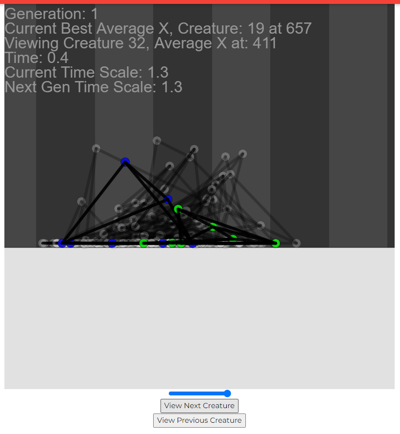

# 2.2.11 Cycle 11 - Eliminating memory leak

## Overview

Causes:\
composites (collisions) not being removed\
tensors (nn nodes) not being removed

## Design

### Objectives&#x20;

*

### Usability Features


| Variable Name | Use |
| ------------- | --- |
|               |     |
|               |     |
|               |     |
|               |     |
|               |     |

### Pseudocode

```
```

## Development

### Outcome


```
```


### Challenges


## Testing

### Tests

| Test | Instructions | What I expect | What actually happens | Pass/Fail |
| ---- | ------------ | ------------- | --------------------- | --------- |
| 1    |              |               |                       |           |
| 2    |              |               |                       |           |
| 3    |              |               |                       |           |

### Evidence

<figure><figcaption><p>Initial memory leak</p></figcaption></figure>

<figure><figcaption><p>Memory leak after putting matter.world into a variable</p></figcaption></figure>

<figure><figcaption><p>Very slight memory leak caused by tensors</p></figcaption></figure>

<figure><figcaption><p>Memory leak eliminated</p></figcaption></figure>

<figure><figcaption><p>300 generations with no lag.</p></figcaption></figure>
